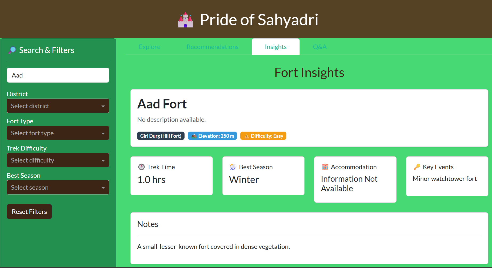
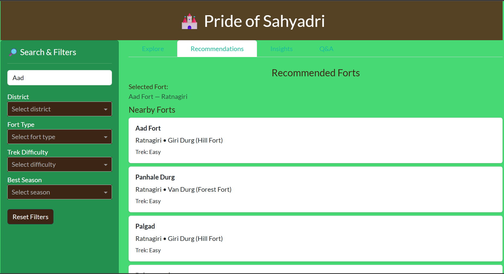
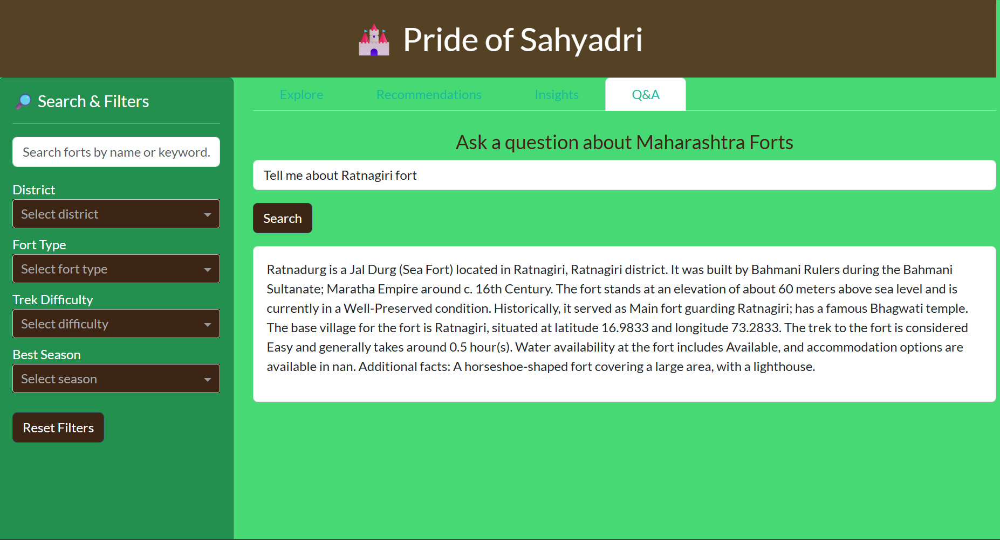

# 🏰 Pride-of-Sahyadri
### *AI-Powered Maharashtra Forts Explorer & Knowledge Engine*

**Pride-of-Sahyadri** is an AI-driven exploration and intelligence platform built around the historic forts of Maharashtra, India.  
It blends **Machine Learning**, **Semantic Search (RAG)**, **Geospatial Analysis**, and a clean **FastAPI backend** to create a powerful knowledge hub for trekkers, historians, researchers, and proud Maharashtrians who value the Sahyadri heritage.

This project honors the legacy of the Maratha Empire and the timeless forts that stand as symbols of resilience, strategy, and regional pride.

---

## 📜 Dataset Credits

This project uses the Maharashtra Forts dataset curated by:

> **Tushar B. Kute**  
> Dataset Source (Kaggle): *Maharashtra Forts — 350+ forts with detailed metadata*

A big thanks to the author for compiling such a rich resource.

---

## 🚀 Features

### 🔍 1. **Semantic RAG Search**

Query the fort knowledge base naturally:

- *"Forts built by Shivaji Maharaj"*
- *"Easy monsoon treks near Pune"*
- *"Sea forts with historical battles"*
- *"Forts important in Maratha-Nizam conflict"*

The RAG engine uses **Sentence-Transformers (`all-MiniLM-L6-v2`)** to encode fort descriptions into embeddings and retrieves the most semantically relevant entries using **cosine similarity**.

---

### 🧠 2. **Locally Built RAG Pipeline**

A fully local, offline-capable RAG pipeline — no external APIs required.

#### Pipeline Architecture

```
CSV Data → Corpus Builder → Sentence Chunker → Embedding Generator
                                                      ↓
                                              Vector Store (cached .pt)
                                                      ↓
User Query → Query Encoder → Cosine Similarity Search → Context Builder
                                                               ↓
                                                    LLM Answer Generator
                                                    (Ollama / flan-t5-base)
```

#### Key Components

| Module | File | Responsibility |
|---|---|---|
| `RAGEngine` | `src/core/rag_engine.py` | End-to-end RAG orchestration |
| `JSONToTextGenerator` | `src/core/llm_decoder.py` | LLM answer generation (flan-t5) |
| Corpus Builder | `RAGEngine.build_corpus()` | Converts fort records to natural language paragraphs |
| Chunker | `RAGEngine.chunk_by_sentences()` | Sliding window sentence chunking (size=5, overlap=2) |
| Indexer | `RAGEngine.build_index()` | Encodes chunks into embeddings; caches to `rag_cache/embeddings.pt` |
| Retriever | `RAGEngine.retrieve()` | Returns top-k chunks via cosine similarity |
| Context Builder | `RAGEngine.build_context()` | Joins top-k retrieved chunks into LLM context |
| Answer Generator | `RAGEngine.generate_answer()` | Sends context + query to Ollama (`mistral` model) |

#### Fort-to-Text Conversion Example

Each fort row is converted to a rich natural language paragraph:

```
Sindhudurg is a Jal Durg (Sea Fort) located in Malvan, Sindhudurg district.
It was built by Shivaji Maharaj during the Maratha Empire around c. 1664.
The fort stands at an elevation of about 10 meters above sea level and is 
currently in a Well-Preserved condition. Historically, it served as the main 
naval base for the Maratha Navy...
```

#### Caching Strategy

| Cache File | Description |
|---|---|
| `rag_cache/corpus.txt` | Pre-built text corpus (reused across restarts) |
| `rag_cache/embeddings.pt` | Pre-computed PyTorch tensor embeddings |

> ⚡ On subsequent runs, both corpus and embeddings are loaded from cache — avoiding recomputation.

---

### 🧭 3. **Recommendation System**

Two recommendation strategies powered by `src/core/recommender.py`:

| Endpoint | Strategy | Description |
|---|---|---|
| `GET /recommend/nearby` | Geodesic Distance | Returns k nearest forts using latitude/longitude |
| `GET /recommend/similar/{fort_id}` | Feature Similarity | Matches forts by type and elevation proximity |

---

### 🗺️ 4. **Geospatial Clustering**

K-Means clustering across:
- Latitude & Longitude
- Elevation
- Trek Difficulty (encoded numerically)

Implemented in `src/core/cluster_engine.py` — provides geographic grouping of forts visible through the API and frontend.

| Endpoint | Description |
|---|---|
| `GET /clusters` | Returns `{cluster_id: count}` |
| `GET /clusters/data` | Returns all forts with cluster labels |
| `POST /clusters/rebuild/{n}` | Rebuild with new cluster count |

---

### 📡 5. **FastAPI Backend**

A decoupled REST API backend — completely independent of the frontend.

**Run the backend:**

```bash
uvicorn src.api.main:app --reload --port 8030
```

**Available Endpoints:**

| Method | Endpoint | Description |
|---|---|---|
| `GET` | `/` | Health check |
| `GET` | `/forts` | List forts (supports `?q=`, `?district=`, `?limit=`) |
| `GET` | `/forts/{fort_id}` | Single fort details |
| `GET` | `/search/semantic_search?q=` | RAG-powered semantic Q&A |
| `GET` | `/clusters` | Cluster summary counts |
| `GET` | `/clusters/data` | All forts with cluster labels |
| `GET` | `/recommend/nearby` | Forts near a coordinate |
| `GET` | `/recommend/similar/{fort_id}` | Similar forts by type/elevation |

Interactive Swagger docs: 👉 [http://localhost:8030/docs](http://localhost:8030/docs)

---

### 🌐 6. **Interactive Plotly Dash Frontend**

A rich, fully interactive frontend built with **Plotly Dash** and **Dash Bootstrap Components** — decoupled from the backend and communicating exclusively via the `APIClient`.

**Run the frontend:**

```bash
python src/frontend/run.py
```

The frontend runs on: 👉 [http://localhost:8050](http://localhost:8050)

#### UI Tabs

| Tab | Description |
|---|---|
| **Explore** | Browse and search all forts with live filters |
| **Recommendations** | View nearby and similar forts for any selected fort |
| **Insights** | Rich fort detail cards with metrics, key events, and notes |
| **Q&A** | Free-text natural language query powered by the RAG pipeline |

#### Sidebar Filters (Live)

- 🔎 Text search (name/keyword)
- 🏘️ District filter
- 🏰 Fort type filter
- 🥾 Trek difficulty filter
- 🌤️ Best season filter
- 🔄 Reset all filters button

#### Frontend–Backend Decoupling

All API communication is handled by `src/frontend/api_client.py` via the `APIClient` class:

```python
api = APIClient(base_url="http://localhost:8030")
```

The frontend never directly imports backend modules — it communicates purely over HTTP, making both layers independently deployable and testable.

| `APIClient` Method | Backend Endpoint |
|---|---|
| `get_forts(params)` | `GET /forts` |
| `get_fort(fort_id)` | `GET /forts/{fort_id}` |
| `get_nearby(lat, lon, k)` | `GET /recommend/nearby` |
| `get_similar(fort_id, k)` | `GET /recommend/similar/{fort_id}` |
| `get_clusters()` | `GET /clusters` |
| `get_clustered_forts()` | `GET /clusters/data` |
| `rag_query(query)` | `GET /search/semantic_search` |

---

## 📁 Project Structure

```
Pride-of-Sahyadri/
├── data/
│   └── maharashtra-forts.csv          # Source dataset (346 forts)
├── rag_cache/
│   ├── corpus.txt                     # Pre-built fort text corpus
│   └── embeddings.pt                  # Cached sentence embeddings
├── logs/
│   └── rag_pipeline_<date>.log        # Rotating log files
├── src/
│   ├── core/
│   │   ├── data_loader.py             # CSV loader with type coercion
│   │   ├── rag_engine.py              # Full RAG pipeline
│   │   ├── llm_decoder.py             # flan-t5 LLM answer generator
│   │   ├── cluster_engine.py          # K-Means clustering
│   │   ├── recommender.py             # Nearby & similar fort logic
│   │   └── logger.py                  # Rotating file + console logger
│   ├── api/
│   │   ├── main.py                    # FastAPI app & router registration
│   │   └── routers/
│   │       ├── forts.py               # Fort CRUD endpoints
│   │       ├── search.py              # RAG semantic search endpoint
│   │       ├── clustering.py          # Cluster endpoints
│   │       └── recommend.py           # Recommendation endpoints
│   └── frontend/
│       ├── app.py                     # Dash app initialization
│       ├── layout.py                  # UI layout (header, sidebar, tabs)
│       ├── callbacks.py               # All Dash reactive callbacks
│       ├── api_client.py              # HTTP client wrapper for backend
│       └── run.py                     # Frontend entry point
├── tests/
│   ├── test_api.py                    # FastAPI endpoint tests
│   └── test_data_loader.py            # Data loading unit tests
├── noebooks/
│   └── maharashtra-forts-analysis.ipynb  # Exploration & prototyping notebook
├── assets/
│   ├── favicon.ico
│   └── mountain.png
├── sindhudurg.json                    # Sample fort JSON record
├── requirements.txt
└── README.md
```

---

## ⚙️ Installation & Setup

### Prerequisites

- Python 3.10+
- [Ollama](https://ollama.ai/) (optional — for LLM-powered Q&A answers)

### 1. Clone & Install

```bash
git clone https://github.com/your-repo/Pride-of-Sahyadri.git
cd Pride-of-Sahyadri
pip install -r requirements.txt
```

### 2. (Optional) Start Ollama for LLM Q&A

```bash
ollama pull mistral
ollama serve
```

> Without Ollama, semantic search still returns retrieved context chunks.

### 3. Start the Backend

```bash
uvicorn src.api.main:app --reload --port 8030
```

### 4. Start the Frontend

```bash
python src/frontend/run.py
```

---

## 🧪 Running Tests

```bash
pytest tests/
```

---

## 🛠️ Tech Stack

| Layer | Technology |
|---|---|
| **Frontend** | Plotly Dash, Dash Bootstrap Components |
| **Backend** | FastAPI, Uvicorn |
| **RAG / NLP** | Sentence-Transformers (`all-MiniLM-L6-v2`), Hugging Face (`flan-t5-base`) |
| **LLM (Q&A)** | Ollama (`mistral`) |
| **ML** | Scikit-learn (K-Means), NumPy, PyTorch |
| **Geospatial** | GeoPy |
| **Data** | Pandas |
| **Logging** | Python `logging` with `RotatingFileHandler` |
| **Testing** | Pytest, FastAPI TestClient |

---

## 🖼️ UI Screenshots

| Explore Tab | Recommendations Tab | Q&A Tab |
|---|---|---|
|  |  |  |

---

## 🙏 Acknowledgements

- **Tushar B. Kute** — Maharashtra Forts dataset (Kaggle)
- **Sentence-Transformers** — MiniLM embeddings
- **Ollama** — Local LLM inference
- The brave warriors and architects of the Sahyadri forts 🏔️